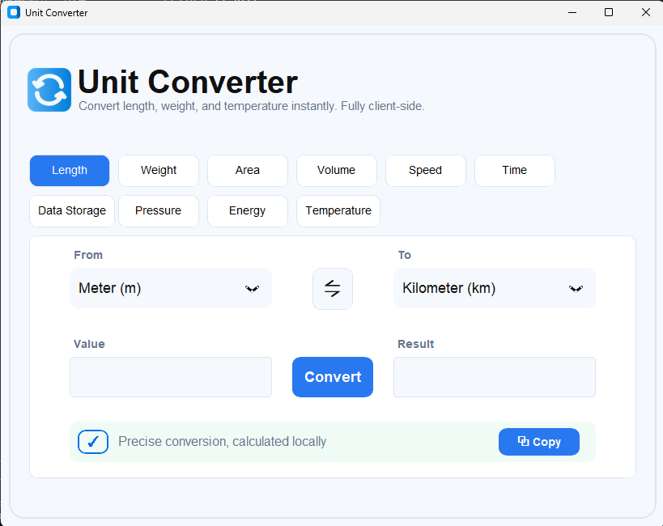
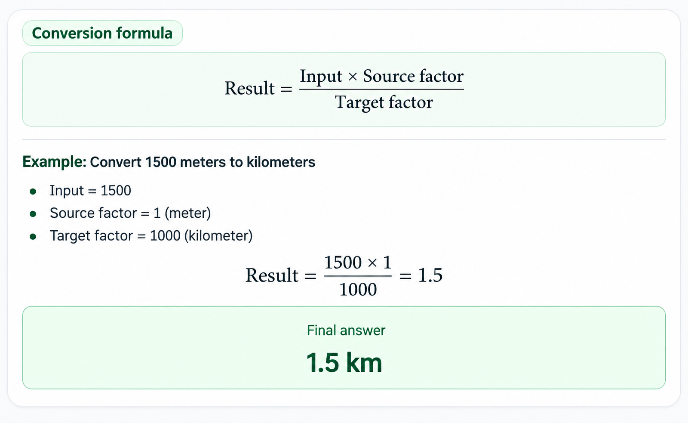

# Unit Converter

A polished desktop **Unit Converter** application built with Python, Tkinter, CustomTkinter, and Pillow. It provides fast, precise, client-side conversions across multiple measurement categories through a clean and modern graphical interface.

The application supports **Length, Weight, Area, Volume, Speed, Time, Data Storage, Pressure, Energy, and Temperature** conversions. Most categories use a base-unit conversion-factor system, while temperature is handled separately because Celsius, Fahrenheit, and Kelvin require offset-based formulas.

---

## 📸 Application Screenshot

### Main Application



### Conversion Formula Example



---

## ✨ Features

- 🎯 Clean and modern desktop interface
- 🔄 Conversion between multiple units within a category
- 📏 10 supported conversion categories
- 🌡️ Dedicated Celsius, Fahrenheit, and Kelvin conversion logic
- ⇋ One-click **From / To** unit swapping
- ⌨️ Press **Enter** to convert
- 📋 Copy converted results directly to the clipboard
- ❌ Input validation with helpful error messages
- 🔢 Smart number formatting that removes unnecessary trailing zeros
- 💻 Fully local/client-side calculations
- 🎨 CustomTkinter light theme with a blue visual style
- 🖼️ Pillow-powered application logo/image support
- 📦 Suitable for packaging as a standalone Windows `.exe`

---

## 📚 Supported Conversion Categories

The current application contains the following categories and units.

### 1. Length

| Unit | Symbol |
|---|---|
| Meter | m |
| Kilometer | km |
| Centimeter | cm |
| Millimeter | mm |
| Mile | mi |
| Yard | yd |
| Foot | ft |
| Inch | in |

### 2. Weight

| Unit | Symbol |
|---|---|
| Kilogram | kg |
| Gram | g |
| Milligram | mg |
| Pound | lb |
| Ounce | oz |
| Tonne | t |

### 3. Area

| Unit |
|---|
| Square Meter |
| Square Kilometer |
| Square Centimeter |
| Square Foot |
| Square Yard |
| Acre |
| Hectare |

### 4. Volume

| Unit |
|---|
| Liter |
| Milliliter |
| Cubic Meter |
| Cubic Centimeter |
| Gallon (US) |
| Quart (US) |
| Pint (US) |

### 5. Speed

| Unit | Symbol |
|---|---|
| Meter/Second | m/s |
| Kilometer/Hour | km/h |
| Mile/Hour | mph |
| Foot/Second | ft/s |
| Knot | kn |

### 6. Time

| Unit |
|---|
| Second |
| Minute |
| Hour |
| Day |
| Week |
| Month (30 days) |
| Year (365 days) |

### 7. Data Storage

| Unit | Symbol |
|---|---|
| Byte | B |
| Kilobyte | KB |
| Megabyte | MB |
| Gigabyte | GB |
| Terabyte | TB |
| Bit | bit |

### 8. Pressure

| Unit | Symbol |
|---|---|
| Pascal | Pa |
| Kilopascal | kPa |
| Bar | bar |
| Atmosphere | atm |
| PSI | PSI |
| Torr | Torr |

### 9. Energy

| Unit | Symbol |
|---|---|
| Joule | J |
| Kilojoule | kJ |
| Calorie | cal |
| Kilocalorie | kcal |
| Watt-hour | Wh |
| Kilowatt-hour | kWh |

### 10. Temperature

| Unit | Symbol |
|---|---|
| Celsius | °C |
| Fahrenheit | °F |
| Kelvin | K |

---

## ⚙️ How It Works

The application stores conversion units in a central `CONVERSIONS` dictionary.

For most categories, every unit has a conversion factor relative to that category's base unit.

The conversion process is:

1. Read the numeric value entered by the user.
2. Identify the selected category.
3. Identify the **From** and **To** units.
4. Convert the input into the category's base unit.
5. Convert the base-unit value into the selected target unit.
6. Format the result.
7. Display the converted value in the result field.

The core conversion logic follows this pattern:

```text
Input
  ↓
Source Unit
  ↓
Category Base Unit
  ↓
Target Unit
  ↓
Formatted Result
```

Temperature is the exception. It is converted through **Celsius** because temperature conversions are not purely multiplicative.

The application also includes separate functionality for:

- Unit selection
- Unit swapping
- Input validation
- Clipboard copying
- Result formatting
- Temperature conversion

---

## 🧮 Conversion Formulas

### General Conversion Formula

For categories such as Length, Weight, Area, Volume, Speed, Time, Data Storage, Pressure, and Energy:

```text
Base Value = Input × Source Factor

Result = Base Value ÷ Target Factor
```

Therefore:

```text
Result = (Input × Source Factor) / Target Factor
```

### Example: Meters → Kilometers

Convert **1500 meters** to kilometers.

```text
Input = 1500

Source factor = 1
Target factor = 1000

Result = (1500 × 1) / 1000
       = 1.5
```

Final result:

```text
1500 m = 1.5 km
```

### Temperature Formula

Temperature uses a dedicated conversion path through Celsius.

#### Fahrenheit → Celsius

```text
°C = (°F - 32) × 5 / 9
```

#### Kelvin → Celsius

```text
°C = K - 273.15
```

#### Celsius → Fahrenheit

```text
°F = (°C × 9 / 5) + 32
```

#### Celsius → Kelvin

```text
K = °C + 273.15
```

The application combines these steps when converting between any two of Celsius, Fahrenheit, and Kelvin.

---

## 🛠️ Technologies

### Python

The core programming language used to implement the application logic and graphical user interface.

### Tkinter

Python's standard GUI toolkit, used alongside CustomTkinter and for native message boxes.

### CustomTkinter

Used to create the modern user interface, including:

- Buttons
- Frames
- Labels
- Entry fields
- Option menus
- Modern colors
- Rounded corners
- Light appearance mode

### Pillow

Used to load and display the application logo/image.

---

## 📁 Project Structure

A recommended project structure is:

```text
Unit-Converter/
│
├── Unitconverter.py
├── arrows.png
├── README.md
│
└── assets/
    ├── unit-converter-interface.png
    └── conversion-formula.png
```

### File Description

| File / Folder | Purpose |
|---|---|
| `Unitconverter.py` | Main Python application |
| `arrows.png` | Application logo loaded by the GUI |
| `README.md` | Project documentation |
| `assets/` | README screenshots and documentation images |

> **Important:** `arrows.png` is loaded directly by the application. Keep it in the same directory as `Unitconverter.py` unless the image path in the code is changed.

---

## 📦 Installation

### 1. Install Python

Install a recent version of Python 3.

Verify the installation:

```bash
python --version
```

or:

```bash
py --version
```

### 2. Clone or download the project

Place the project files in the same project directory.

### 3. Install the required packages

Install CustomTkinter and Pillow:

```bash
pip install customtkinter pillow
```

Tkinter is included with standard Python installations on Windows. If your Python distribution does not include it, install the appropriate Tk/Tcl package for your operating system.

---

## ▶️ How to Run

Open a terminal inside the project directory and run:

```bash
python Unitconverter.py
```

On Windows, you can also use:

```bash
py Unitconverter.py
```

The **Unit Converter** window should open.

### Basic Usage

1. Select a conversion category.
2. Choose the **From** unit.
3. Choose the **To** unit.
4. Enter a numeric value.
5. Click **Convert** or press **Enter**.
6. View the result.
7. Use **⇋** to swap the units.
8. Use **Copy** to copy the result to the clipboard.

---

## 🪟 Creating the `.exe`

You can package the application as a standalone Windows executable using **PyInstaller**.

### 1. Install PyInstaller

```bash
pip install pyinstaller
```

### 2. Build the executable

Because the application uses `arrows.png`, include that image when building the executable:

```bash
pyinstaller --onefile --windowed --add-data "arrows.png;." Unitconverter.py
```

### 3. Find the executable

After the build completes, the executable will be placed inside:

```text
dist/
```

For example:

```text
dist/
└── Unitconverter.exe
```

### Optional: Use a Custom Executable Name

```bash
pyinstaller --onefile --windowed --name "Unit Converter" --add-data "arrows.png;." Unitconverter.py
```

### Important Note About Image Paths

The current Python code loads the logo using:

```python
Image.open("arrows.png")
```

For a packaged `.exe`, the image path may need to be resolved relative to the executable's bundled resources if the application is distributed outside the development folder.

A production-ready version can use a resource-path helper so the logo works reliably in both:

- Normal Python execution
- PyInstaller `.exe` execution

---

## 🚀 Future Improvements

Possible enhancements for future versions include:

- [ ] Add a conversion history panel
- [ ] Add dark mode
- [ ] Add more units to existing categories
- [ ] Add currency conversion
- [ ] Add more scientific/engineering units
- [ ] Add favorites or recently used conversions
- [ ] Add keyboard shortcuts
- [ ] Add automatic conversion while typing
- [ ] Add precision/decimal-place controls
- [ ] Add a searchable unit selector
- [ ] Add copy confirmation animations
- [ ] Improve packaged-resource handling for the `.exe`
- [ ] Add application settings
- [ ] Add automated unit-conversion tests
- [ ] Create installers for easier Windows distribution

---

## 👨‍💻 Author

**Project Author**

Unit Converter — a desktop utility application for quick and precise unit conversions.

---

## 📄 License

Add your preferred license here, such as **MIT License**, if you plan to distribute the project publicly.
